# hoist — Sequence Diagrams

ICP coverage:
- **ICP-A** Solo indie developer (primary)
- **ICP-B** Multi-project developer (3+ concurrent subdomains)
- **ICP-C** ngrok muscle-memory switcher
- **ICP-D** Returning/lapsed user (stale state)

---

## ICP-A/C — S01: First-time install and init (happy path)

> Developer downloads hoist, authenticates with Cloudflare, and exposes their first subdomain. Domain is already on Cloudflare DNS.

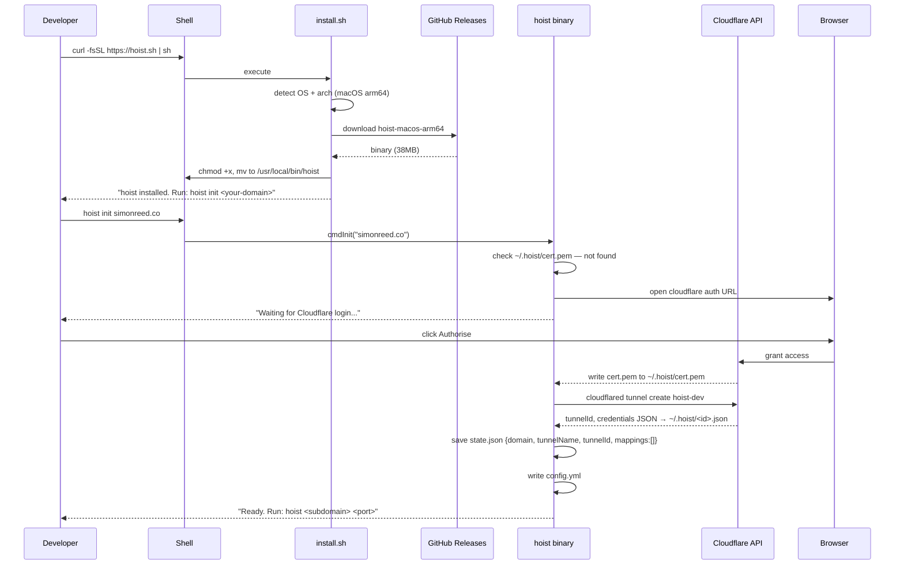
```mermaid
sequenceDiagram
  participant Dev as Developer
  participant Shell as Shell
  participant Script as install.sh
  participant GH as GitHub Releases
  participant Bin as hoist binary
  participant CF as Cloudflare API
  participant Browser as Browser

  Dev->>Shell: curl -fsSL https://hoist.sh | sh
  Shell->>Script: execute
  Script->>Script: detect OS + arch (macOS arm64)
  Script->>GH: download hoist-macos-arm64
  GH-->>Script: binary (38MB)
  Script->>Shell: chmod +x, mv to /usr/local/bin/hoist
  Script-->>Dev: "hoist installed. Run: hoist init <your-domain>"

  Dev->>Shell: hoist init simonreed.co
  Shell->>Bin: cmdInit("simonreed.co")
  Bin->>Bin: check ~/.hoist/cert.pem — not found
  Bin->>Browser: open cloudflare auth URL
  Bin-->>Dev: "Waiting for Cloudflare login..."
  Dev->>Browser: click Authorise
  Browser->>CF: grant access
  CF-->>Bin: write cert.pem to ~/.hoist/cert.pem
  Bin->>CF: cloudflared tunnel create hoist-dev
  CF-->>Bin: tunnelId, credentials JSON → ~/.hoist/<id>.json
  Bin->>Bin: save state.json {domain, tunnelName, tunnelId, mappings:[]}
  Bin->>Bin: write config.yml
  Bin-->>Dev: "Ready. Run: hoist <subdomain> <port>"
```

---

## ICP-A — S02: Daily usage — single subdomain (happy path)

> Developer starts their morning by exposing passflow on port 5555.

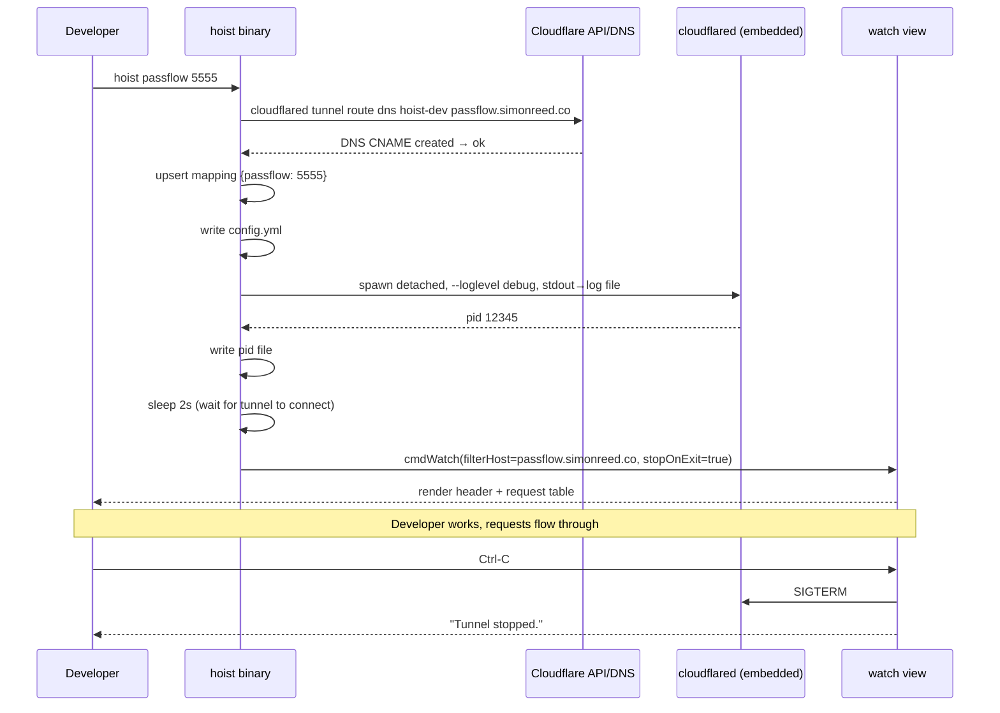
```mermaid
sequenceDiagram
  participant Dev as Developer
  participant Bin as hoist binary
  participant CF as Cloudflare API/DNS
  participant CFd as cloudflared (embedded)
  participant Watch as watch view

  Dev->>Bin: hoist passflow 5555
  Bin->>CF: cloudflared tunnel route dns hoist-dev passflow.simonreed.co
  CF-->>Bin: DNS CNAME created → ok
  Bin->>Bin: upsert mapping {passflow: 5555}
  Bin->>Bin: write config.yml
  Bin->>CFd: spawn detached, --loglevel debug, stdout→log file
  CFd-->>Bin: pid 12345
  Bin->>Bin: write pid file
  Bin->>Bin: sleep 2s (wait for tunnel to connect)
  Bin->>Watch: cmdWatch(filterHost=passflow.simonreed.co, stopOnExit=true)
  Watch-->>Dev: render header + request table

  Note over Dev,Watch: Developer works, requests flow through

  Dev->>Watch: Ctrl-C
  Watch->>CFd: SIGTERM
  Watch-->>Dev: "Tunnel stopped."
```

---

## ICP-B — S03: Multiple subdomains simultaneously

> Developer needs passflow (5555) and assay (3000) both live at the same time.

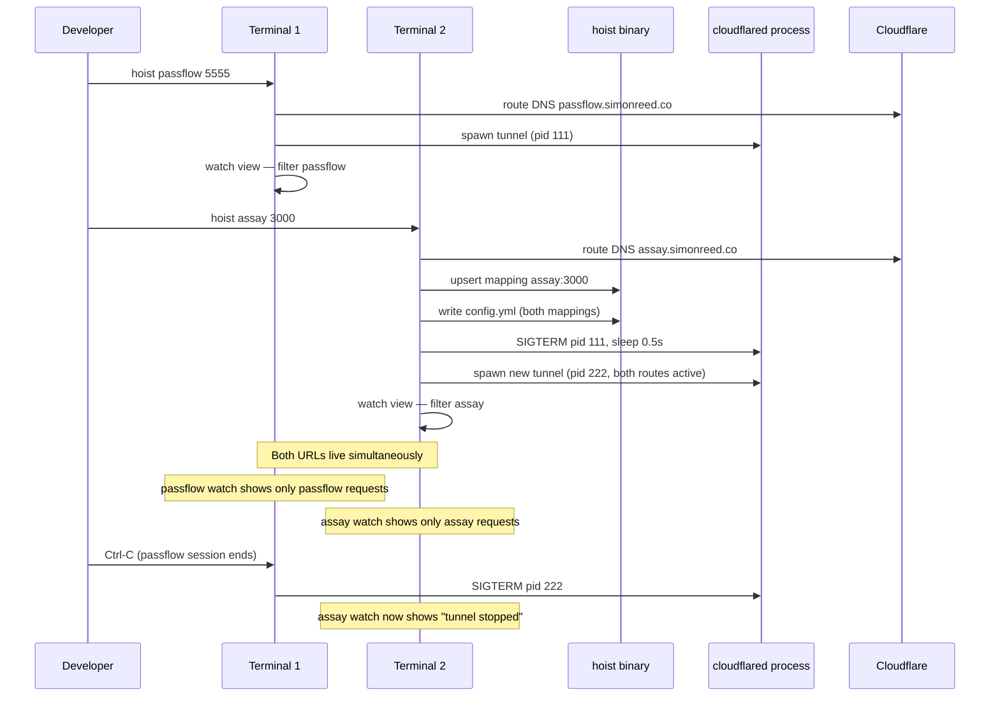
```mermaid
sequenceDiagram
  participant Dev as Developer
  participant T1 as Terminal 1
  participant T2 as Terminal 2
  participant Bin as hoist binary
  participant CFd as cloudflared process
  participant CF as Cloudflare

  Dev->>T1: hoist passflow 5555
  T1->>CF: route DNS passflow.simonreed.co
  T1->>CFd: spawn tunnel (pid 111)
  T1->>T1: watch view — filter passflow

  Dev->>T2: hoist assay 3000
  T2->>CF: route DNS assay.simonreed.co
  T2->>Bin: upsert mapping assay:3000
  T2->>Bin: write config.yml (both mappings)
  T2->>CFd: SIGTERM pid 111, sleep 0.5s
  T2->>CFd: spawn new tunnel (pid 222, both routes active)
  T2->>T2: watch view — filter assay

  Note over T1,T2: Both URLs live simultaneously
  Note over T1: passflow watch shows only passflow requests
  Note over T2: assay watch shows only assay requests

  Dev->>T1: Ctrl-C (passflow session ends)
  T1->>CFd: SIGTERM pid 222
  Note over T2: assay watch now shows "tunnel stopped"
```

---

## ICP-B — S04: Adding subdomain while tunnel already running

> Developer already has passflow running and adds membercanoe without closing the first session.

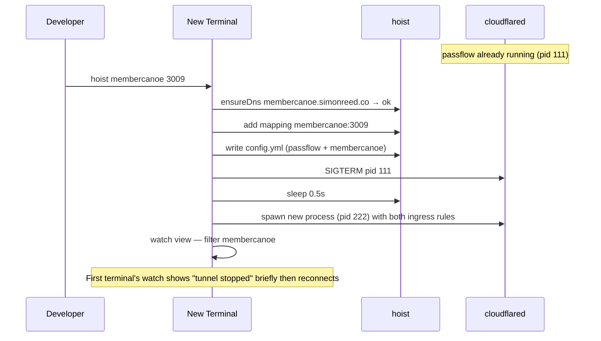
```mermaid
sequenceDiagram
  participant Dev as Developer
  participant T2 as New Terminal
  participant Bin as hoist
  participant CFd as cloudflared

  Note over CFd: passflow already running (pid 111)

  Dev->>T2: hoist membercanoe 3009
  T2->>Bin: ensureDns membercanoe.simonreed.co → ok
  T2->>Bin: add mapping membercanoe:3009
  T2->>Bin: write config.yml (passflow + membercanoe)
  T2->>CFd: SIGTERM pid 111
  T2->>Bin: sleep 0.5s
  T2->>CFd: spawn new process (pid 222) with both ingress rules
  T2->>T2: watch view — filter membercanoe
  Note over T2: First terminal's watch shows "tunnel stopped" briefly then reconnects
```

---

## ICP-A — S05: Port not listening (local server down)

> Developer runs hoist but forgot to start their local server.

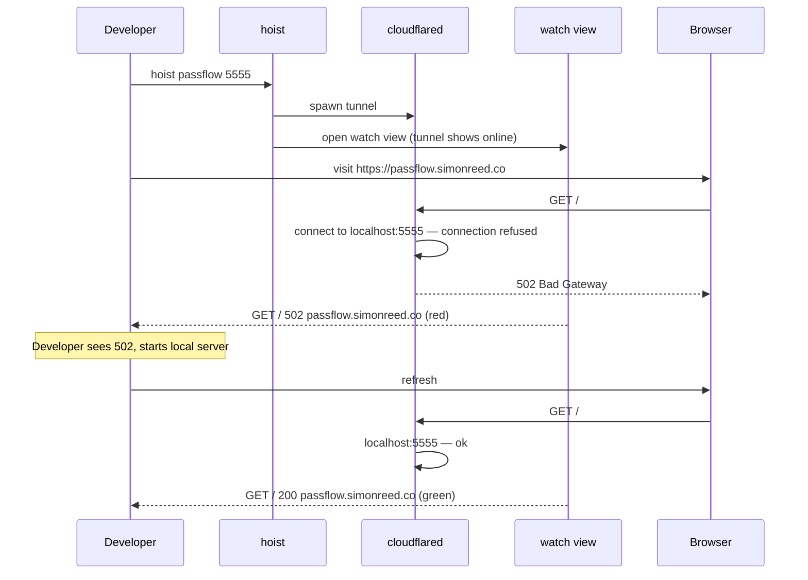
```mermaid
sequenceDiagram
  participant Dev as Developer
  participant Bin as hoist
  participant CFd as cloudflared
  participant Watch as watch view
  participant Browser as Browser

  Dev->>Bin: hoist passflow 5555
  Bin->>CFd: spawn tunnel
  Bin->>Watch: open watch view (tunnel shows online)

  Dev->>Browser: visit https://passflow.simonreed.co
  Browser->>CFd: GET /
  CFd->>CFd: connect to localhost:5555 — connection refused
  CFd-->>Browser: 502 Bad Gateway
  Watch-->>Dev: GET  /  502  passflow.simonreed.co  (red)

  Note over Dev: Developer sees 502, starts local server
  Dev->>Browser: refresh
  Browser->>CFd: GET /
  CFd->>CFd: localhost:5555 — ok
  Watch-->>Dev: GET  /  200  passflow.simonreed.co  (green)
```

---

## ICP-D — S06: Returning user — stale PID (machine rebooted)

> Developer rebooted. PID file exists but process is gone. Runs hoist again.

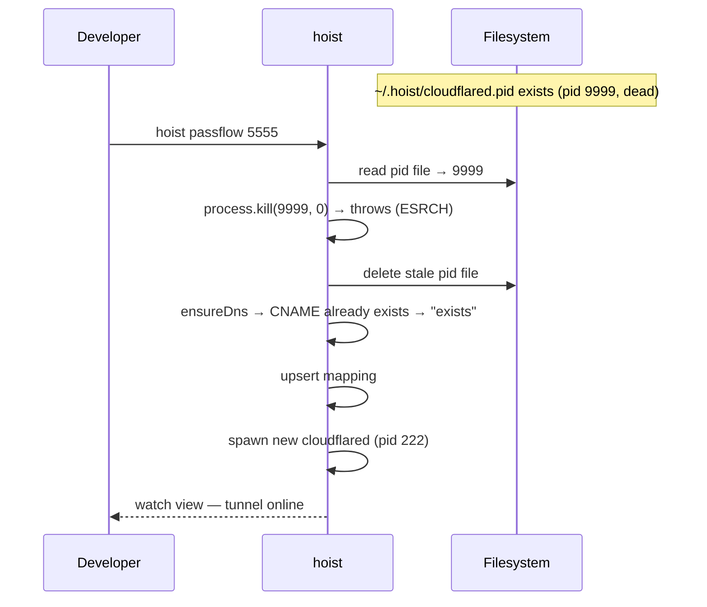
```mermaid
sequenceDiagram
  participant Dev as Developer
  participant Bin as hoist
  participant FS as Filesystem

  Note over FS: ~/.hoist/cloudflared.pid exists (pid 9999, dead)

  Dev->>Bin: hoist passflow 5555
  Bin->>FS: read pid file → 9999
  Bin->>Bin: process.kill(9999, 0) → throws (ESRCH)
  Bin->>FS: delete stale pid file
  Bin->>Bin: ensureDns → CNAME already exists → "exists"
  Bin->>Bin: upsert mapping
  Bin->>Bin: spawn new cloudflared (pid 222)
  Bin-->>Dev: watch view — tunnel online
```

---

## ICP-D — S07: Returning user — Cloudflare credentials expired

> Developer's cert.pem has expired. Running hoist init again re-authenticates.

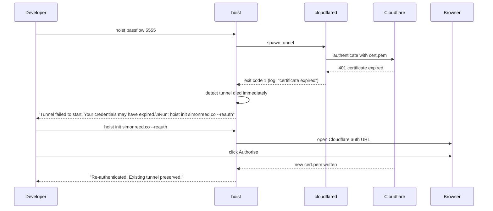
```mermaid
sequenceDiagram
  participant Dev as Developer
  participant Bin as hoist
  participant CFd as cloudflared
  participant CF as Cloudflare
  participant Browser as Browser

  Dev->>Bin: hoist passflow 5555
  Bin->>CFd: spawn tunnel
  CFd->>CF: authenticate with cert.pem
  CF-->>CFd: 401 certificate expired
  CFd-->>Bin: exit code 1 (log: "certificate expired")
  Bin->>Bin: detect tunnel died immediately
  Bin-->>Dev: "Tunnel failed to start. Your credentials may have expired.\nRun: hoist init simonreed.co --reauth"

  Dev->>Bin: hoist init simonreed.co --reauth
  Bin->>Browser: open Cloudflare auth URL
  Dev->>Browser: click Authorise
  CF-->>Bin: new cert.pem written
  Bin-->>Dev: "Re-authenticated. Existing tunnel preserved."
```

---

## ICP-A — S08: DNS record already exists pointing to same tunnel

> Developer runs hoist passflow 5555 a second day. CNAME already exists.

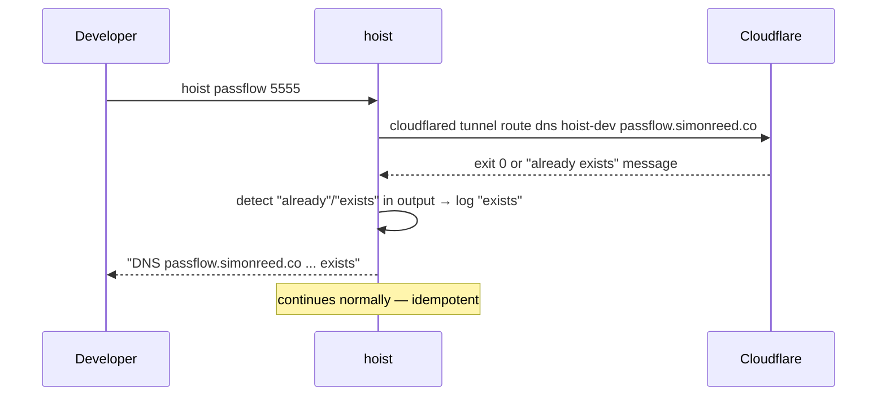
```mermaid
sequenceDiagram
  participant Dev as Developer
  participant Bin as hoist
  participant CF as Cloudflare

  Dev->>Bin: hoist passflow 5555
  Bin->>CF: cloudflared tunnel route dns hoist-dev passflow.simonreed.co
  CF-->>Bin: exit 0 or "already exists" message
  Bin->>Bin: detect "already"/"exists" in output → log "exists"
  Bin-->>Dev: "DNS passflow.simonreed.co ... exists"
  Note over Bin: continues normally — idempotent
```

---

## ICP-A — S09: DNS record conflict — points to different tunnel

> Developer previously used a different tunnel. DNS CNAME points somewhere else.

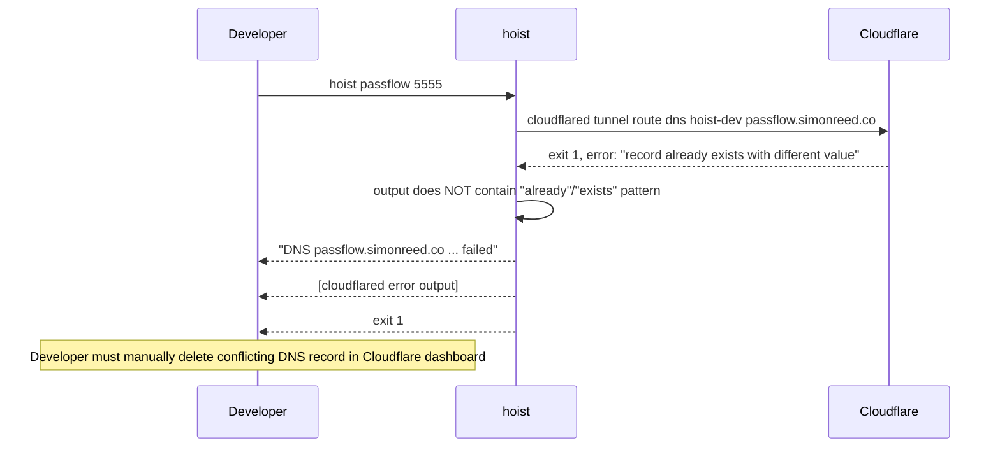
```mermaid
sequenceDiagram
  participant Dev as Developer
  participant Bin as hoist
  participant CF as Cloudflare

  Dev->>Bin: hoist passflow 5555
  Bin->>CF: cloudflared tunnel route dns hoist-dev passflow.simonreed.co
  CF-->>Bin: exit 1, error: "record already exists with different value"
  Bin->>Bin: output does NOT contain "already"/"exists" pattern
  Bin-->>Dev: "DNS passflow.simonreed.co ... failed"
  Bin-->>Dev: [cloudflared error output]
  Bin-->>Dev: exit 1
  Note over Dev: Developer must manually delete conflicting DNS record in Cloudflare dashboard
```

---

## ICP-A — S10: hoist rm — mappings remain

> Developer removes assay but passflow stays active.

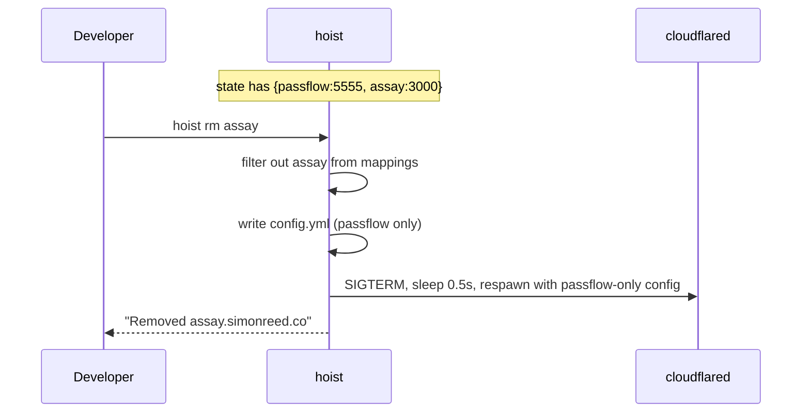
```mermaid
sequenceDiagram
  participant Dev as Developer
  participant Bin as hoist
  participant CFd as cloudflared

  Note over Bin: state has {passflow:5555, assay:3000}

  Dev->>Bin: hoist rm assay
  Bin->>Bin: filter out assay from mappings
  Bin->>Bin: write config.yml (passflow only)
  Bin->>CFd: SIGTERM, sleep 0.5s, respawn with passflow-only config
  Bin-->>Dev: "Removed assay.simonreed.co"
```

---

## ICP-A — S11: hoist rm — last mapping removed

> Developer removes the only active subdomain.

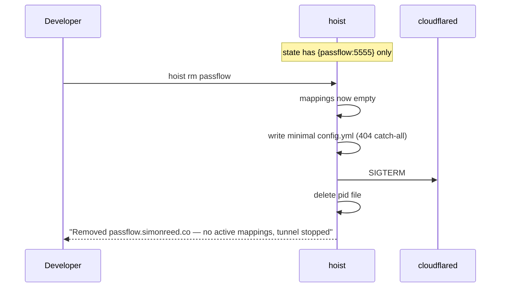
```mermaid
sequenceDiagram
  participant Dev as Developer
  participant Bin as hoist
  participant CFd as cloudflared

  Note over Bin: state has {passflow:5555} only

  Dev->>Bin: hoist rm passflow
  Bin->>Bin: mappings now empty
  Bin->>Bin: write minimal config.yml (404 catch-all)
  Bin->>CFd: SIGTERM
  Bin->>Bin: delete pid file
  Bin-->>Dev: "Removed passflow.simonreed.co — no active mappings, tunnel stopped"
```

---

## ICP-A — S12: Tunnel process crashes mid-session

> cloudflared dies unexpectedly (OOM, signal, etc.) while watch view is open.

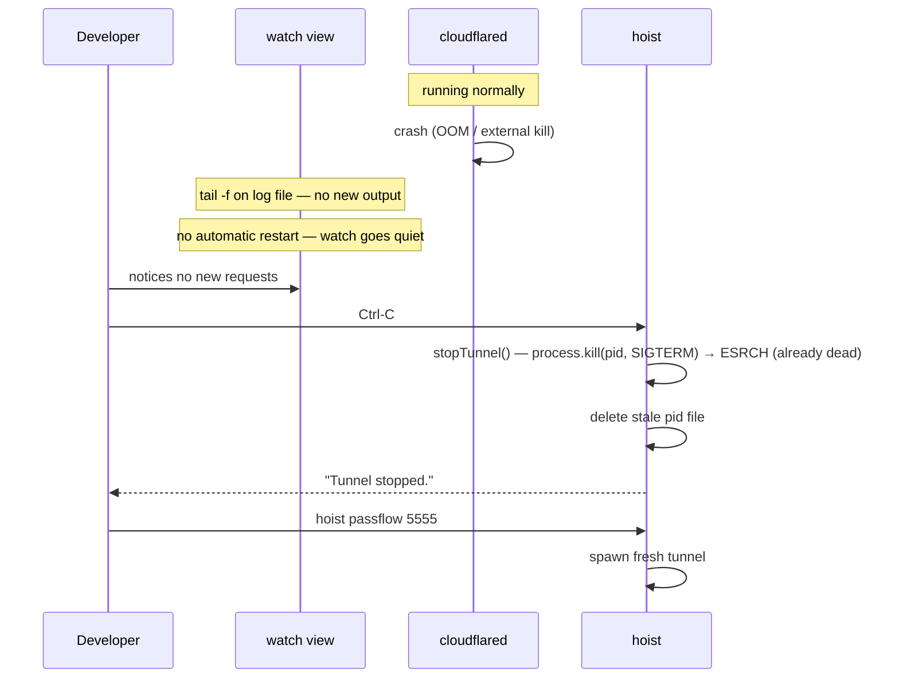
```mermaid
sequenceDiagram
  participant Dev as Developer
  participant Watch as watch view
  participant CFd as cloudflared
  participant Bin as hoist

  Note over CFd: running normally

  CFd->>CFd: crash (OOM / external kill)
  Note over Watch: tail -f on log file — no new output
  Note over Watch: no automatic restart — watch goes quiet

  Dev->>Watch: notices no new requests
  Dev->>Bin: Ctrl-C
  Bin->>Bin: stopTunnel() — process.kill(pid, SIGTERM) → ESRCH (already dead)
  Bin->>Bin: delete stale pid file
  Bin-->>Dev: "Tunnel stopped."

  Dev->>Bin: hoist passflow 5555
  Bin->>Bin: spawn fresh tunnel
```

---

## ICP-C — S13: hoist watch standalone (does NOT stop tunnel on Ctrl-C)

> Developer opens watch view independently without starting a new session.

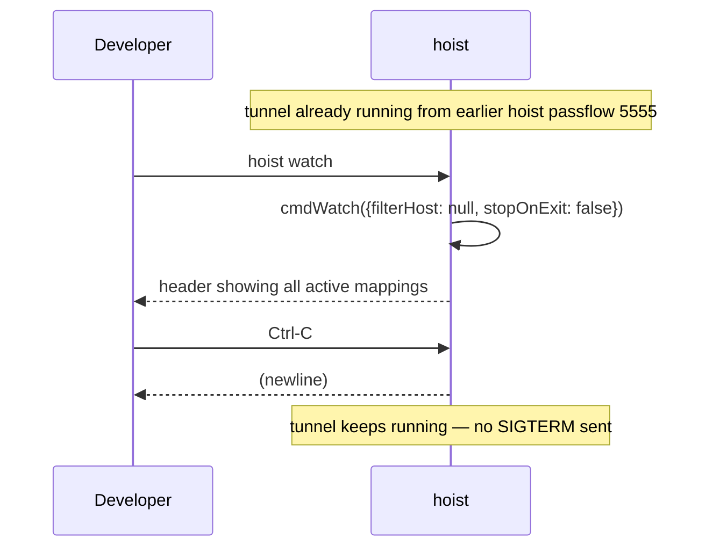
```mermaid
sequenceDiagram
  participant Dev as Developer
  participant Bin as hoist

  Note over Bin: tunnel already running from earlier hoist passflow 5555

  Dev->>Bin: hoist watch
  Bin->>Bin: cmdWatch({filterHost: null, stopOnExit: false})
  Bin-->>Dev: header showing all active mappings

  Dev->>Bin: Ctrl-C
  Bin-->>Dev: (newline)
  Note over Bin: tunnel keeps running — no SIGTERM sent
```

---

## ICP-A — S14: hoist ls — no mappings configured

> Developer runs hoist ls after init but before any hoist <subdomain> <port>.

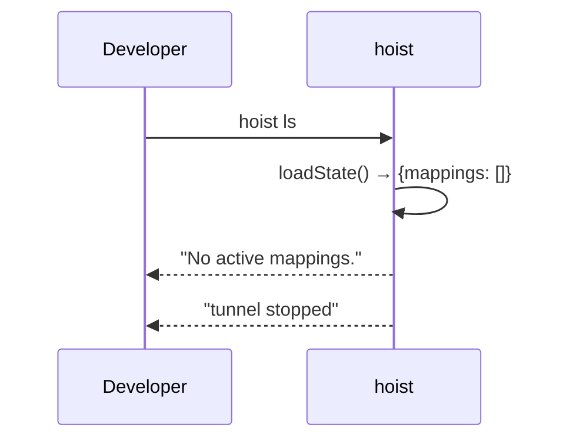
```mermaid
sequenceDiagram
  participant Dev as Developer
  participant Bin as hoist

  Dev->>Bin: hoist ls
  Bin->>Bin: loadState() → {mappings: []}
  Bin-->>Dev: "No active mappings."
  Bin-->>Dev: "tunnel  stopped"
```

---

## ICP-A — S15: hoist before init (no state file)

> Developer installed hoist but hasn't run init yet.

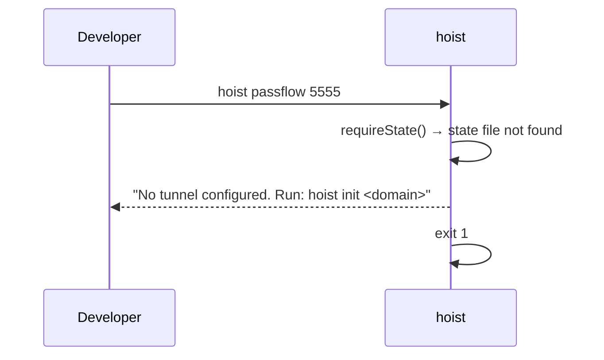
```mermaid
sequenceDiagram
  participant Dev as Developer
  participant Bin as hoist

  Dev->>Bin: hoist passflow 5555
  Bin->>Bin: requireState() → state file not found
  Bin-->>Dev: "No tunnel configured. Run: hoist init <domain>"
  Bin->>Bin: exit 1
```

---

## ICP-C — S16: init — domain not on Cloudflare DNS

> Developer runs hoist init but their domain's DNS is not managed by Cloudflare.

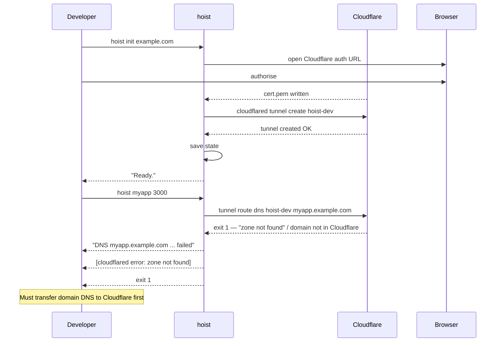
```mermaid
sequenceDiagram
  participant Dev as Developer
  participant Bin as hoist
  participant CF as Cloudflare
  participant Browser as Browser

  Dev->>Bin: hoist init example.com
  Bin->>Browser: open Cloudflare auth URL
  Dev->>Browser: authorise
  CF-->>Bin: cert.pem written
  Bin->>CF: cloudflared tunnel create hoist-dev
  CF-->>Bin: tunnel created OK
  Bin->>Bin: save state
  Bin-->>Dev: "Ready."

  Dev->>Bin: hoist myapp 3000
  Bin->>CF: tunnel route dns hoist-dev myapp.example.com
  CF-->>Bin: exit 1 — "zone not found" / domain not in Cloudflare
  Bin-->>Dev: "DNS myapp.example.com ... failed"
  Bin-->>Dev: [cloudflared error: zone not found]
  Bin-->>Dev: exit 1
  Note over Dev: Must transfer domain DNS to Cloudflare first
```

---

## ICP-A — S17: install.sh — /usr/local/bin not writable

> Developer's machine requires sudo for /usr/local/bin.

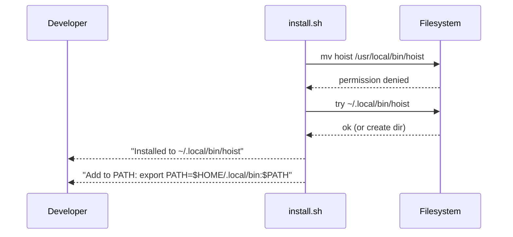
```mermaid
sequenceDiagram
  participant Dev as Developer
  participant Script as install.sh
  participant FS as Filesystem

  Script->>FS: mv hoist /usr/local/bin/hoist
  FS-->>Script: permission denied
  Script->>FS: try ~/.local/bin/hoist
  FS-->>Script: ok (or create dir)
  Script-->>Dev: "Installed to ~/.local/bin/hoist"
  Script-->>Dev: "Add to PATH: export PATH=$HOME/.local/bin:$PATH"
```

---

## ICP-A — S18: install.sh — Linux x86_64

> Developer on Linux installs hoist.

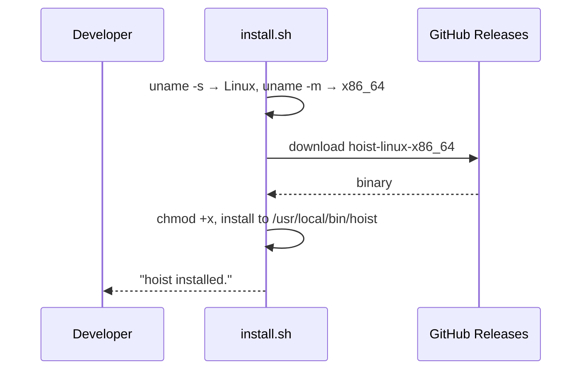
```mermaid
sequenceDiagram
  participant Dev as Developer
  participant Script as install.sh
  participant GH as GitHub Releases

  Script->>Script: uname -s → Linux, uname -m → x86_64
  Script->>GH: download hoist-linux-x86_64
  GH-->>Script: binary
  Script->>Script: chmod +x, install to /usr/local/bin/hoist
  Script-->>Dev: "hoist installed."
```

---

## ICP-A — S19: install.sh — unsupported platform

> Developer on Windows or unsupported architecture.

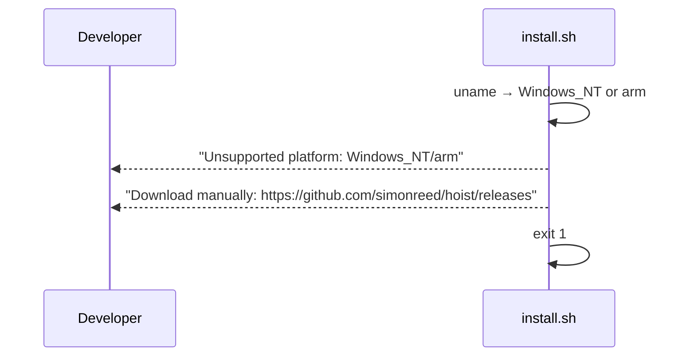
```mermaid
sequenceDiagram
  participant Dev as Developer
  participant Script as install.sh

  Script->>Script: uname → Windows_NT or arm
  Script-->>Dev: "Unsupported platform: Windows_NT/arm"
  Script-->>Dev: "Download manually: https://github.com/simonreed/hoist/releases"
  Script->>Script: exit 1
```

---

## ICP-D — S20: Self-extraction of embedded cloudflared on first run

> First time hoist binary runs after install — cloudflared not yet extracted.

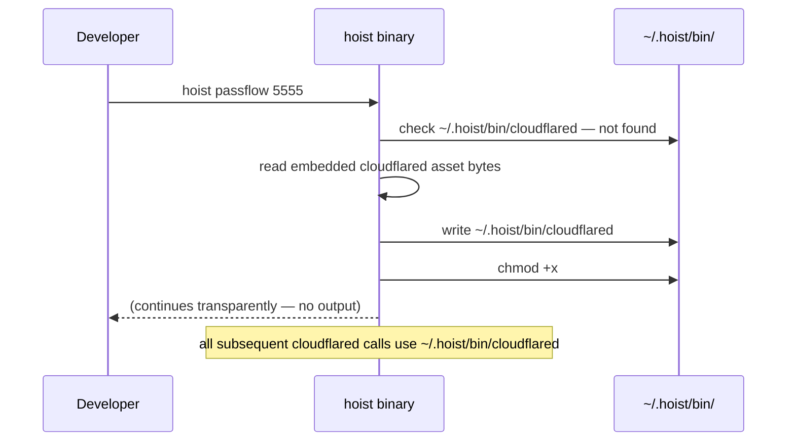
```mermaid
sequenceDiagram
  participant Dev as Developer
  participant Bin as hoist binary
  participant FS as ~/.hoist/bin/

  Dev->>Bin: hoist passflow 5555
  Bin->>FS: check ~/.hoist/bin/cloudflared — not found
  Bin->>Bin: read embedded cloudflared asset bytes
  Bin->>FS: write ~/.hoist/bin/cloudflared
  Bin->>FS: chmod +x
  Bin-->>Dev: (continues transparently — no output)
  Note over Bin: all subsequent cloudflared calls use ~/.hoist/bin/cloudflared
```
